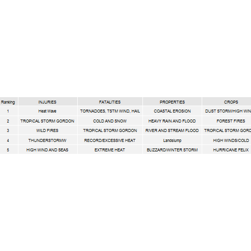

  
---

    
#### The Data Analysis
Human impacts are given by the field **FATALITIES** and **INJURIES**.  

Economic Impact is given by the damages to **PROPERtIES** and **CROP**

The method uses was to determine the mena value for each type of events:
- mean of Fatalities
- mean for Injuries
 - mean for Crop damage
 - mean for proprety damage
 
The top 5 for each categories is then taken to be the more significants


---


#### Synopsis

This study anylyses **Storm Data** ( <https://d396qusza40orc.cloudfront.net/repdata%2Fdata%2FStormData.csv.bz2>)which colects storms and other severe weather events which tracks the characteristics of major storms and weather events in the United States,from 1950 to November 2011.  
There are 2 parts to the data anylysis:  
 - Part one is the data processing  
 - Part 2, reporting and presentation of the results.
 Both the human and economic impacts are investigated
 
---

#### Data Processing


```r
library(plyr)
library(ggplot2)
```

```
## Warning: package 'ggplot2' was built under R version 3.1.1
```

```r
library(gridExtra)
```

```
## Warning: package 'gridExtra' was built under R version 3.1.1
```

```
## Loading required package: grid
```

```r
library(xtable)
```

```
## Warning: package 'xtable' was built under R version 3.1.1
```

```r
#library(tables)

mydata<-read.csv("repdata_data_StormData.csv",sep=",",header=TRUE, stringsAsFactors=FALSE)
# a quick look at the dataset..
# str(mydata)
```
The field **EVTYPE** contains the required data.  
One idea is to select the "mean impact" caused by each event type and assess them.  

There are 2 events causing harm to human being : 
- **Fatalities**(FATALITIES) 
- **Injuries** (INJURIES´) 

---

### Harm to Human Beings

---

#### EVENT = Fatalities  
  
  
The below code calculates the mean number of **fatalities** per eventy type  

  

```r
#Mean Fatalities
my_fatal<-aggregate(mydata$FATALITIES~EVTYPE,data=mydata,FUN="mean")
colnames(my_fatal)<-c("EVENTS","FATALITIES")
max_fat<-max(my_fatal$FATALITIES)
max_fatalities<-subset(my_fatal, FATALITIES==max_fat)
my_fatal1<-my_fatal[order(my_fatal$FATALITIES, decreasing=TRUE), ]  # sort in order
```
  
    
    
#### EVENT = Injuries  
  
  The below code calculates the mean number of **Injuries** per eventy type  
    
    

```r
#Injuries
#
my_injuries<-aggregate(mydata$INJURIES~EVTYPE,data=mydata,FUN="mean")
colnames(my_injuries)<-c("EVENTS","INJURIES")
max_inj<-max(my_injuries$INJURIES)
max_injuries<-subset(my_injuries, INJURIES==max_inj)
my_injuries1<-my_injuries[order(my_injuries$INJURIES, decreasing=TRUE), ] # sort in order
```

---

### Economic Damage

---

The relevant fields are : **Property Damage**(`PROPDMG`) and **Crop Damage** (`CROPDMG`).  

Again using the average damages as parameter  


#### EVENT = Damaged Properties


```r
#Mean Properties
my_property<-aggregate(mydata$PROPDMG~EVTYPE,data=mydata,FUN="mean")
colnames(my_property)<-c("EVENTS","PROPERTY")
max_prop<-max(my_property$PROPERTY)
max_properties<-subset(my_property, PROPERTY==max_prop)
my_properties1<-my_property[order(my_property$PROPERTY, decreasing=TRUE), ]  # sort in order
```


#### EVENT =  Damaged Crops


```r
#
my_crop<-aggregate(mydata$CROPDMG~EVTYPE,data=mydata,FUN="mean")
colnames(my_crop)<-c("EVENTS","CROP")
max_crop<-max(my_crop$CROP)
max_crops<-subset(my_crop, CROP==max_crop)
my_crop1<-my_crop[order(my_crop$CROP, decreasing=TRUE), ]  # sort in order
```

  
    
    
---
  
    
    

### REPORTS

#### A. Impact to humans : FATALITIES 

##### (1) 5 most significant storm events causing **Fatalities**


```r
#5 Highest Cause of  Fatalities

my_fatal2<-head(my_fatal1,5)
my_fatal2
```

```
##                         EVENTS FATALITIES
## 842 TORNADOES, TSTM WIND, HAIL     25.000
## 72               COLD AND SNOW     14.000
## 851      TROPICAL STORM GORDON      8.000
## 580      RECORD/EXCESSIVE HEAT      5.667
## 142               EXTREME HEAT      4.364
```

  
##### (2). 5 most significant storm events causing **INJURIES**  


```r
#Highest causes of Injuries
#
my_injuries2<-head(my_injuries1,5)
my_injuries2
```

```
##                    EVENTS INJURIES
## 277             Heat Wave     70.0
## 851 TROPICAL STORM GORDON     43.0
## 954            WILD FIRES     37.5
## 821         THUNDERSTORMW     27.0
## 366    HIGH WIND AND SEAS     20.0
```

---

    
#### B. Economic Impact :   


(1). 5 most significant storm events causing **Property Damage**


```r
#Mean Properties

my_properties2<-head(my_properties1,5)
my_properties2
```

```
##                     EVENTS PROPERTY
## 52         COASTAL EROSION      766
## 291   HEAVY RAIN AND FLOOD      600
## 589 RIVER AND STREAM FLOOD      600
## 445              Landslump      570
## 38   BLIZZARD/WINTER STORM      500
```


(2). 5 most significant storm events causing **Crop Damage**


```r
my_crop2<-head(my_crop1,5)
my_crop2
```

```
##                    EVENTS CROP
## 118 DUST STORM/HIGH WINDS  500
## 190          FOREST FIRES  500
## 851 TROPICAL STORM GORDON  500
## 392       HIGH WINDS/COLD  401
## 407       HURRICANE FELIX  250
```

---


### GRAPHS & FIGURES Presenting the Results


#### 1. FIGURE : Table of the first 5 most significant events for each type of damage/harm  


```r
t<-c(1:5)
t1<-my_injuries2$EVENTS
t2<-my_fatal2$EVENTS
t3<-my_properties2$EVENTS
t4<-my_crop2$EVENTS
Result<-cbind(t,t1,t2,t3,t4)
colnames(Result)<-c("Ranking","INJURIES","FATALITIES","PROPERTIES","CROPS")
Result1<-as.data.frame(Result)
grid.table(Result1,gpar.coretext = gpar(fontsize=8),gpar.coltext = gpar(fontsize = 8))
```

 


#### 2. PLOT : Human Suffering   

    


```r
plot1<-qplot(EVENTS, FATALITIES, data=my_fatal2,geom="point")
plot2<-qplot(EVENTS, INJURIES, data=my_injuries2,geom="point")
grid.arrange(plot1,plot2,nrow=2)
```

 

```r
dev.off()
```

```
## null device 
##           1
```


#### 3. PLOT : Economic Damages  


```r
plot3<-qplot(EVENTS, PROPERTY, data=my_properties2,geom="point")
plot4<-qplot(EVENTS, CROP, data=my_crop2,geom="point")
grid.arrange(plot3,plot4,nrow=2)
```

 

```r
dev.off()
```

```
## null device 
##           1
```


